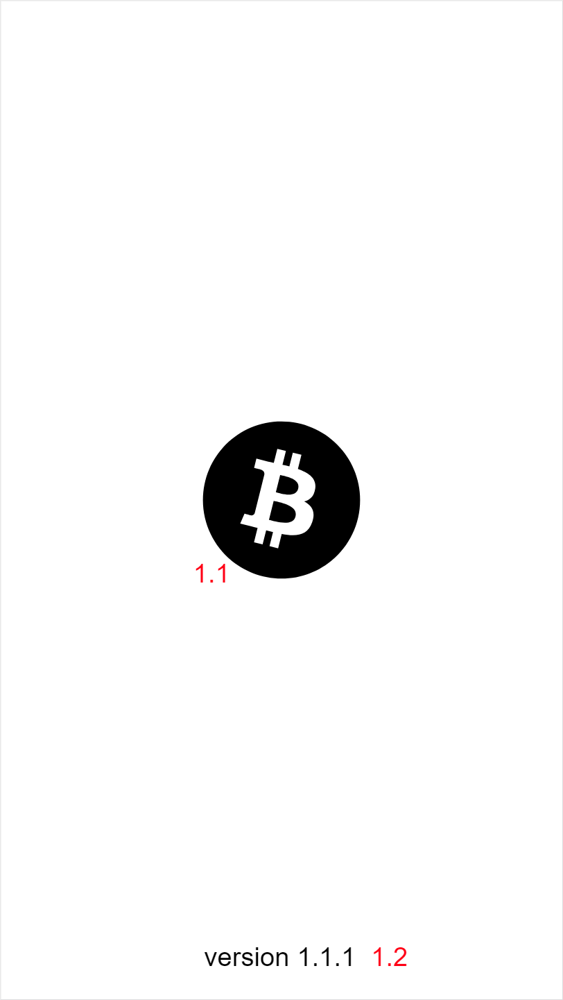
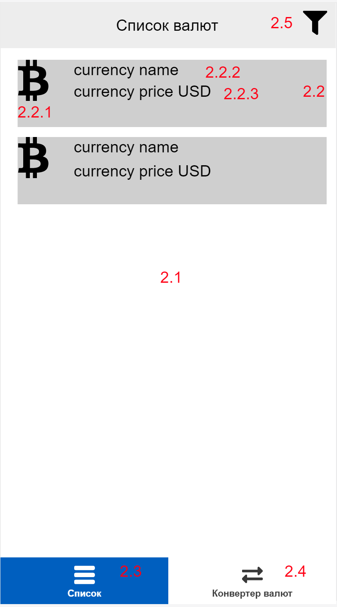
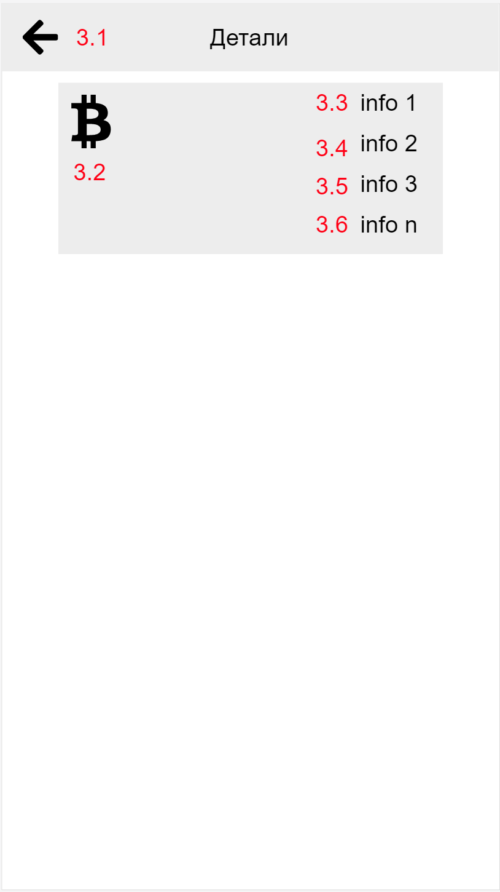
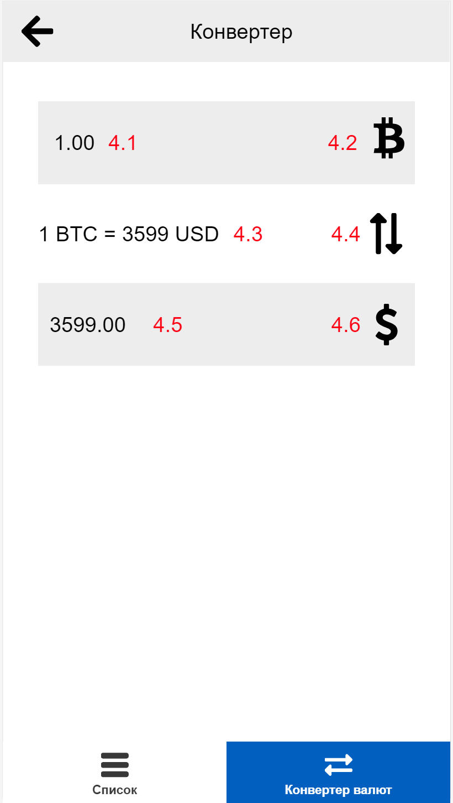
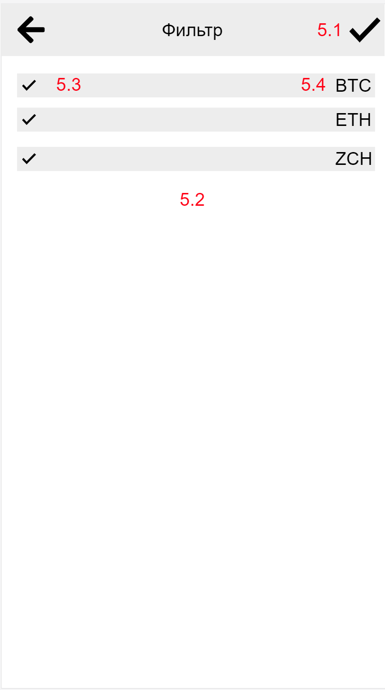

# Android приложение "Курсы криптовалют"
Приложение предназначено для просмотра актульных курсов криптовалют с возможностью разнонаправленной конвертации.

Дополнительные требования помечены красным цветом или символами *** (Github может не отрисовывать цветной текст)
## Описание экранов приложения
### 1. Splashscreen

Эмулирует первоначальную инициализацию приложения. Отображается на 2 секунды при запуске приложения. По прошествии 2 секунд, должен отобразиться экран `Список криптовалют`

| Номер элемента| Описание           |
| ------------- |:------------------:|
| 1.1           | Логотип приложения |
| 1.2           | Версия приложения  |

### 2. Список валют

Отображает список криптовалют с краткой информацией о каждой из них. Во время загрузки данных необходимо отображать любой `Loader`, например, `ProgressWheel`. 
При отсутствии подключения к интернету, необходимо отображать данные из локального кэша приложения ***

| Номер элемента| Описание           |
| ------------- |:------------------:|
| 2.1           | Список криптовалют |
| 2.2           | Элемент списка. По нажатию на элемент осуществляется переход на экран `Детали`  |
| 2.2.1         | Иконка криптовалюты  |
| 2.2.2         | Название криптовалюты  |
| 2.2.3         | Текущая стоимость одной монеты в USD  |
| 2.3           | Элемент BottomNavigation. Переход на экран списка криптовалют  |
| 2.4           | Элемент BottomNavigation. Переход на экран конвертера  |
| 2.5         | Элемент AppBar. Переход на экран фильтра  |

### 3. Детали

Отображает наиболее полную информацию о выбранной криптовалюте

| Номер элемента| Описание           |
| ------------- |:------------------:|
| 3.1           | Элемент AppBar. Переход на предыдущий жкран |
| 3.2           | Иконка криптовалюты  |
| 3.3 - 3.6           | Дополнительные данные о валюте  |

### 4. Конвертер валют

| Номер элемента| Описание           |
| ------------- |:------------------:|
| 4.1           | Поле ввода конвертируемого значения. Формат - 2 знака после запятой |
| 4.2           | Кнопка выбора валюты источника конвертации. По нажатию отображается диалог выбора валюты  |
| 4.3           | Строка отображения курса валюты из `4.2` относительно валюты из `4.6`  |
| 4.4           | Кнопка смены направления конвертации|
| 4.5           | Отображает сконвертированное значение  |
| 4.6           | Кнопка выбора валюты назначения конвертации. По нажатию отображается диалог выбора валюты  |

### 5. Фильтр

Создает фильтр для списка валют. После применения фильтра на экране `Список валют` отображаются только выбранные криптовалюты

| Номер элемента| Описание           |
| ------------- |:------------------:|
| 5.1           | Элемент AppBar. Применяет созданный фильтр на экране `Список валют` |
| 5.2           | Список элементов для создания фильтра  |
| 5.3           | Checkbox  |
| 5.4           | Аббривеатура криптовалюты  |

## Получение данных
Для получения данных о криптовалютах использовать любое общедоступное API, например, [Coinmarket](https://coinmarketcap.com/api/)

## Стек технологий
- Java/Kotlin
- RxJava 2
- Retrofit2
- Room
- Dagger/Koin***
- View Binding, к примеру Butterknife ***

## Архитектурные требования
- В приложении должны быть использованы `Порождающие`, `Структурные` и `Поведенческие` паттерны
- Приложение должно быть адекватно разделено на слои (MVP***, MVVM***, Clean architecture*** , etc)

## Работа с исходным кодом
- Исходный код приложения хранится в VCS Git
- Файл `.gitignore` должен быть сконфигурирован

## Сборка приложения
- Скрипт сборки `build.gradle` не должен содержать неиспользуемые зависимости
- Для сборки на локальной машине развернуть Jenkins***

## Рекомендуемая к прочтению литература
- «Совершенный код» - Стив Макконнелл
- «Рефакторинг. Улучшение существующего кода» - Мартин Фаулер
- «Приёмы объектно-ориентированного проектирования. Паттерны проектирования» -  Эрих Гамма, Ричард Хелм, Ральф Джонсон, Джон Влиссидес
- «Android. Программирование для профессионалов» - Филлипс Б., Стюарт К., Марсикано К
- «Эффективное использование потоков в операционной системе Android. Технологии асинхронной обработки данных» - Андерс Ёранссон
