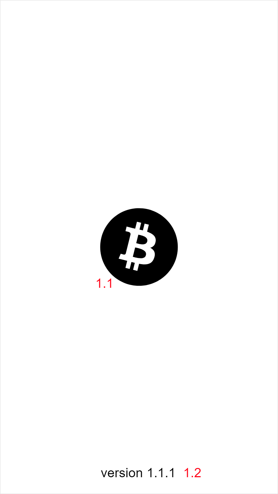
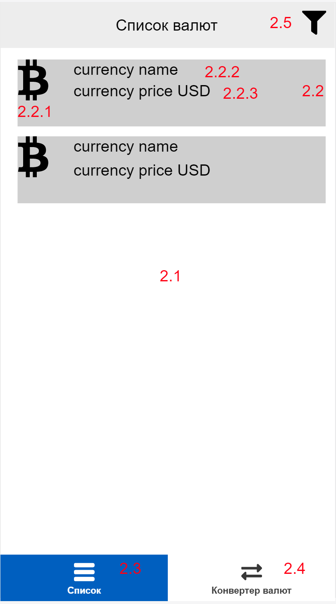

## Android приложение "Курсы криптовалют"

### Описание экранов приложения
Приложение должно содержать следующие экраны:
## Splashscreen

Эмулирует первоначальную инициализацию приложения. Отображается на 2 секунды при запуске приложения. По прошествии 2 секунд, должен отобразиться экран `Список криптовалют`

| Номер элемента| Описание           |
| ------------- |:------------------:|
| 1.1           | Логотип приложения |
| 1.2           | Версия приложения  |

## Список валют
Отображает список криптовалют, полученный с помощью запроса 

| Номер элемента| Описание           |
| ------------- |:------------------:|
| 2.1           | Список криптовалют |
| 2.2           | Эелемент списка  |
| 2.2.1         | Иконка криптовалюты  |
| 2.2.2         | Название криптовалюты  |
| 2.2.3         | Текущая стоимость одной монеты в USD  |
| 2.3           | Элемент BottomNavigation. Переход на экран списка криптовалют  |
| 2.4           | Элемент BottomNavigation. Переход на экран конвертера  |
| 2.5         | Элемент AppBar. Переход на экран фильтра  |

### Технические требования
- Java/Kotlin
- RxJava 2
- Retrofit2
- Room
- Dagger/Koin
- View Binding, к примеру Butterknife
- Clean Architecture
- MVVM
